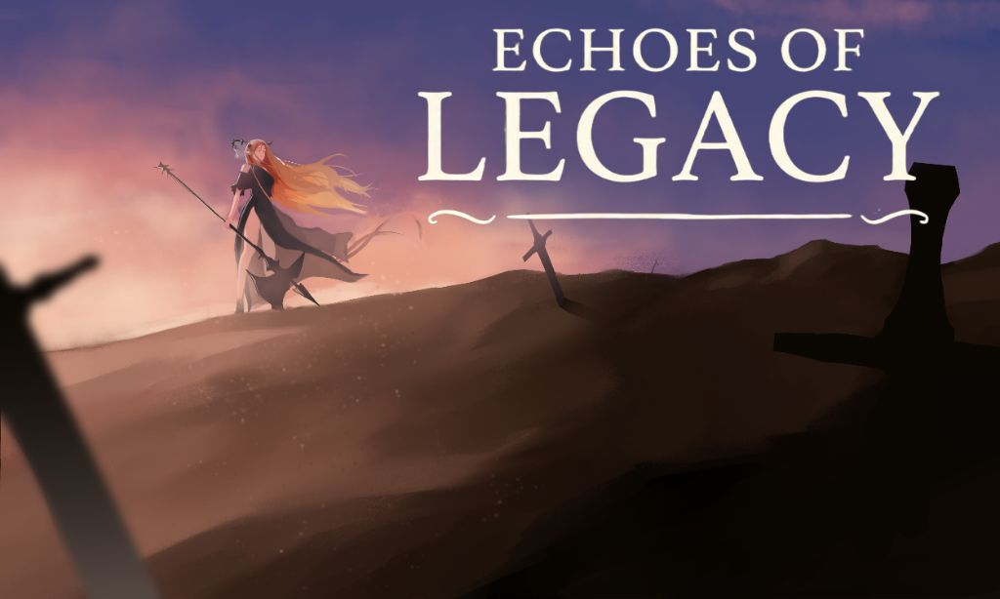
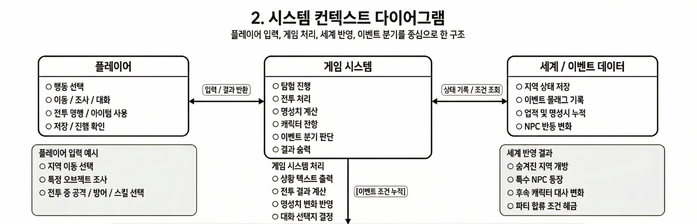

# Conceptualization

## Echoes of Legacy
### A Fantasy Turn-based Roguelike with Multi-character Legacy System

**학번:** 22210087  
**이름:** 김현서  
**이메일:** cinema312@naver.com

---

## Revision History

| Version | Date | Description |
|---|---|---|
| 0.1 | 2026-03-26 | 초안 작성 |

---

## Contents

1. [Business Purpose](#1-business-purpose)
2. [System Context Diagram](#2-system-context-diagram)
3. [Use Case List](#3-use-case-list)
4. [Concept of Operation](#4-concept-of-operation)
5. [Problem Statement](#5-problem-statement)
6. [Glossary](#6-glossary)
7. [References](#7-references)

---

## 1. Business Purpose

### 1) Project Background
이 프로젝트는 유니티 기반의 게임엔진으로 만든 판타지 세계를 배경으로 한 턴제 로그라이크 게임을 기획하는 것을 목적으로 한다. 기존 로그라이크 게임은 반복 플레이를 통해 캐릭터를 성장시키고, 전투와 선택을 통해 전략적인 재미를 준다는 장점이 있다. 하지만 대부분 하나의 캐릭터를 중심으로 진행되기 때문에, 이전 플레이의 기록이 이후 플레이와 자연스럽게 이어지는 경우는 많지 않다. 그래서 플레이어가 세계관 전체를 하나의 흐름으로 경험하기에는 아쉬운 점이 있다고 생각했다.

이 프로젝트에서는 이런 점을 보완하기 위해, 서로 다른 캐릭터를 순차적으로 플레이하면서도 이전 캐릭터의 성장, 업적, 선택, 생존 여부가 이후 캐릭터의 플레이와 세계 상태에 영향을 주는 구조를 넣고자 한다. 플레이어는 한 명의 주인공만 계속 조작하는 것이 아니라, 세계 곳곳에서 살아가는 여러 인물을 차례대로 경험하게 된다. 그리고 각 캐릭터가 남긴 기록과 선택이 쌓이면서, 하나의 세계 이야기가 이어지는 방식으로 진행되도록 구성하고자 한다.

특히 이 게임은 화려한 그래픽이나 복잡한 실시간 전투보다는 텍스트와 간단한 정적 이미지를 중심으로 진행되도록 기획하고 있다. 이를 통해 서사와 선택의 의미를 더 강조할 수 있고, 동시에 개발 범위를 현실적으로 조절할 수 있다고 생각했다. 또한 캐릭터 사이의 연결성, 세계의 변화, 후일담 탐험 같은 요소를 통해 일반적인 로그라이크와는 다른 재미를 주고자 한다.

또한 게임을 진행하면서 플레이 방식이나 특정 행동, 전투 결과에 따라 명성치가 쌓이도록 구성하고자 한다. 이 명성치가 일정 수치 이상이 되면 특수 이벤트가 발생하며, 그 결과는 이후 다른 캐릭터의 진행에도 영향을 미치게 된다. 그리고 기존 캐릭터로 특정 지점에 도달하면 다른 캐릭터의 시점으로 전환되어 플레이가 이어지고, 이후 이벤트에 따라 이전에 플레이했던 캐릭터와 만나 파티를 이루는 등 캐릭터 간 상호작용도 가능하도록 설계하고자 한다.

### 2) Goal
이 프로젝트의 핵심 목적은 다음과 같다. 첫째, 다중 캐릭터 진행 구조를 통해 기존 로그라이크와 차별화된 플레이 경험을 제공하는 것이다. 둘째, 플레이 기록이 세계에 축적되는 레거시 시스템을 통해 탐험의 의미를 강화하는 것이다. 셋째, 텍스트 중심의 인터페이스와 간단한 이미지 구성을 활용하여 학기 프로젝트 수준에서 구현 가능한 범위 안에서 완성도 있는 게임 기획을 제시하는 것이다.

### 3) Target Market
주요 대상 사용자는 판타지 세계관, 로그라이크 장르, 선택형 서사 구조에 흥미를 가진 사람들이다. 특히 반복 플레이 속에서도 이전 선택의 결과가 이후 이야기로 이어지는 경험을 선호하는 사용자에게 잘 맞을 것으로 생각한다.

기대 효과는 다음과 같다. 첫째, 플레이어는 단순히 한 번의 모험을 끝내는 것이 아니라, 여러 캐릭터의 흔적이 쌓여가는 세계를 장기적으로 탐험하는 경험을 할 수 있다. 둘째, 게임 시스템 측면에서는 캐릭터 전환, 세계 상태 반영, 후일담 탐험을 하나로 연결하여 독창적인 기획 방향을 보여줄 수 있다. 셋째, 프로젝트 수행 측면에서는 구현 범위를 적절히 조절함으로써 실제 개발 가능성을 고려한 설계 문서를 완성할 수 있다.

---

## 2. System Context Diagram

> 같은 폴더에 `system_context_diagram_final_kr.png` 파일을 함께 업로드하면 아래 이미지 링크가 정상 표시된다.

플레이어의 선택은 게임 시스템에서 처리되고, 그 결과가 세계와 이벤트 데이터에 누적되어 이후 캐릭터의 진행에도 계속 반영된다.

---

## 3. Use Case List

### 1) 새 게임 시작
**Actor**  
Player / Game System

**Description**  
새로운 게임을 시작하고 초기 세계 상태 및 기본 캐릭터 정보를 불러온다.

### 2) 불러오기
**Actor**  
Player / Game System

**Description**  
저장된 진행 데이터를 불러와 이전 시점부터 게임을 이어서 진행한다.

### 3) 캐릭터 선택
**Actor**  
Player

**Description**  
현재 플레이할 캐릭터를 선택하고 해당 캐릭터의 시점에서 탐험을 시작한다.

### 4) 탐험지 선택
**Actor**  
Player

**Description**  
지역을 이동하거나 조사하면서 텍스트와 간단한 이미지를 통해 상황을 확인한다.

### 5) 이벤트
**Actor**  
Player / Game System

**Description**  
오브젝트를 조사하거나 NPC와 대화하여 정보, 아이템, 이벤트를 획득한다.

### 6) 선택지
**Actor**  
Player / Game System

**Description**  
주어진 선택지 중 하나를 선택하여 스토리 진행 방향이나 결과를 결정한다.

### 7) 전투 시스템
**Actor**  
Game System

**Description**  
적과 조우했을 때 턴제 방식으로 공격, 방어, 스킬 사용 등의 전투를 수행한다.

### 8) 명성치 획득
**Actor**  
Player

**Description**  
전투 결과나 특정 행동에 따라 명성치를 획득하고, 그 수치를 누적한다.

### 9) 특수 이벤트
**Actor**  
Game System

**Description**  
누적된 명성치나 특정 조건을 바탕으로 특수 이벤트를 발생시킨다.

### 10) 이전 플레이 반영
**Actor**  
Game System

**Description**  
이전 캐릭터의 선택, 업적, 생존 여부를 세계 데이터에 반영하고 이후 진행에 적용한다.

### 11) 파티 시스템
**Actor**  
Player / Game System

**Description**  
조건을 충족한 캐릭터들이 재회하여 파티를 구성하고 함께 행동할 수 있게 한다.

### 12) 자동 저장
**Actor**  
Player / Game System

**Description**  
현재 캐릭터 정보와 세계 상태, 명성치, 이벤트 진행 상황 등을 저장한다.

---

## 4. Concept of Operation

### 1) 새 게임 시작
**Purpose**  
플레이어가 새로운 게임을 시작하고 기본 진행 환경을 초기화할 수 있도록 한다.

**Approach**  
플레이어가 새 게임을 선택하면 게임 시스템은 초기 세계 상태, 시작 가능한 캐릭터 정보, 기본 이벤트 상태를 불러와 새로운 진행 데이터를 생성한다.

**Dynamics**  
게임 시작 화면에서 플레이어가 새 게임을 선택할 경우 수행된다.

**Goals**  
새로운 플레이를 시작할 수 있도록 초기 게임 환경을 구성한다.

### 2) 불러오기
**Purpose**  
이전에 저장한 진행 상태를 불러와 이어서 플레이할 수 있도록 한다.

**Approach**  
플레이어가 불러오기를 선택하면 게임 시스템은 저장된 캐릭터 정보, 세계 상태, 명성치, 이벤트 진행 상황을 불러와 마지막 저장 지점부터 게임을 재개한다.

**Dynamics**  
게임 시작 화면이나 메인 메뉴에서 불러오기를 선택할 경우 수행된다.

**Goals**  
저장된 진행 상태를 복원하여 플레이를 이어갈 수 있도록 한다.

### 3) 캐릭터 선택
**Purpose**  
플레이어가 현재 진행할 캐릭터를 선택할 수 있도록 한다.

**Approach**  
게임 시스템은 플레이 가능한 캐릭터 목록과 간단한 특성을 보여주고, 플레이어가 원하는 캐릭터를 선택하면 해당 캐릭터의 시점으로 게임을 진행한다.

**Dynamics**  
새 게임 시작 직후 또는 특정 스토리 진행 이후 캐릭터 선택이 가능할 때 수행된다.

**Goals**  
다중 캐릭터 구조를 통해 각기 다른 시점에서 세계를 탐험할 수 있도록 한다.

### 4) 탐험지 선택
**Purpose**  
플레이어가 이동할 지역이나 조사할 대상을 선택하여 탐험을 진행할 수 있도록 한다.

**Approach**  
게임 시스템은 현재 지역의 설명, 이동 가능한 장소, 조사 가능한 오브젝트 등을 텍스트와 간단한 이미지로 보여주고, 플레이어의 선택에 따라 다음 상황을 출력한다.

**Dynamics**  
탐험 화면에서 플레이어가 이동, 조사, 휴식, 상호작용 등의 행동을 선택할 경우 수행된다.

**Goals**  
플레이어가 세계를 직접 탐험하면서 정보와 이벤트를 자연스럽게 경험하도록 한다.

### 5) 이벤트
**Purpose**  
플레이어가 오브젝트나 NPC와 상호작용하면서 정보, 아이템, 사건을 획득할 수 있도록 한다.

**Approach**  
플레이어가 특정 오브젝트를 조사하거나 NPC와 대화하면 게임 시스템은 조건에 맞는 이벤트를 호출하고, 그 결과에 따라 아이템 획득, 스토리 진행, 상태 변화 등을 반영한다.

**Dynamics**  
탐험 중 특정 장소, 오브젝트, NPC와 상호작용할 때 수행된다.

**Goals**  
탐험 과정에서 새로운 정보와 보상을 제공하고, 세계관 몰입도를 높인다.

### 6) 선택지
**Purpose**  
플레이어의 선택에 따라 스토리 진행 방향과 결과가 달라지도록 한다.

**Approach**  
게임 시스템은 특정 상황에서 여러 개의 선택지를 제시하고, 플레이어가 하나를 선택하면 그에 맞는 결과를 계산하여 이후 진행에 반영한다.

**Dynamics**  
이벤트, 대화, 전투 이후 분기 상황 등에서 선택지가 주어질 때 수행된다.

**Goals**  
플레이어의 판단이 게임 진행에 의미 있는 영향을 주도록 한다.

### 7) 전투 시스템
**Purpose**  
적과 조우했을 때 턴제 방식의 전투를 통해 긴장감과 전략성을 제공한다.

**Approach**  
플레이어가 공격, 방어, 스킬 사용, 아이템 사용 등의 명령을 선택하면 게임 시스템은 캐릭터와 적의 상태를 계산하여 전투 결과를 반영한다.

**Dynamics**  
탐험 중 적과 조우하거나 특정 이벤트로 전투가 발생할 경우 수행된다.

**Goals**  
전투를 통해 게임의 핵심 플레이 요소와 성장 동기를 제공한다.

### 8) 명성치 획득
**Purpose**  
플레이어의 행동 결과를 수치로 누적하여 이후 특수 이벤트 발생 조건으로 활용한다.

**Approach**  
전투 승리, 특정 선택, 주요 이벤트 달성 등의 결과에 따라 게임 시스템이 명성치를 부여하고 누적 수치를 기록한다.

**Dynamics**  
전투 종료 후, 주요 이벤트 완료 후, 특별한 행동을 했을 때 수행된다.

**Goals**  
플레이어의 행동이 단순히 끝나는 것이 아니라 이후 진행에 영향을 주는 기록으로 남도록 한다.

### 9) 특수 이벤트
**Purpose**  
명성치나 특정 조건에 따라 일반 진행과 다른 특별한 이벤트를 발생시킨다.

**Approach**  
게임 시스템은 누적된 명성치, 지역 상태, 이전 선택 결과 등을 확인한 뒤, 조건을 만족할 경우 숨겨진 이벤트나 특수 상황을 발생시킨다.

**Dynamics**  
탐험 중 특정 장소에 도달하거나, 명성치가 일정 수치 이상이 되었을 때 수행된다.

**Goals**  
플레이어의 누적된 행동 결과를 특별한 사건으로 연결하여 게임의 차별성을 강화한다.

### 10) 이전 플레이 반영
**Purpose**  
이전 캐릭터의 선택과 업적이 이후 진행과 세계 상태에 영향을 미치도록 한다.

**Approach**  
게임 시스템은 이전 캐릭터의 생존 여부, 달성한 업적, 선택 결과, 획득한 주요 아이템 등의 정보를 세계 데이터에 저장하고, 후속 캐릭터 진행 시 이를 반영한다.

**Dynamics**  
캐릭터 전환 이후 새로운 캐릭터로 같은 세계를 탐험하거나, 이전에 방문했던 장소를 다시 찾을 때 수행된다.

**Goals**  
각 캐릭터의 플레이가 서로 단절되지 않고 하나의 세계 안에서 이어지도록 한다.

### 11) 파티 시스템
**Purpose**  
조건을 만족한 캐릭터들이 재회하여 함께 행동할 수 있도록 한다.

**Approach**  
게임 시스템은 캐릭터의 생존 여부, 명성치, 스토리 진행 상태, 특정 이벤트 완료 여부 등을 확인한 뒤 조건이 충족되면 파티 구성이 가능하도록 한다.

**Dynamics**  
이전 캐릭터와 연결되는 이벤트가 발생하거나 특정 스토리 구간에 도달했을 때 수행된다.

**Goals**  
개별 캐릭터의 이야기가 하나로 모이도록 하여 게임 후반부의 몰입감과 보상을 높인다.

### 12) 자동 저장
**Purpose**  
현재 진행 상황을 자동으로 저장하여 플레이 흐름을 안정적으로 유지한다.

**Approach**  
게임 시스템은 주요 이벤트 종료 후, 캐릭터 전환 시점, 전투 종료 후 등 특정 시점마다 캐릭터 정보와 세계 상태를 자동 저장한다.

**Dynamics**  
스토리 진행의 주요 구간이나 상태 변화가 발생했을 때 자동으로 수행된다.

**Goals**  
진행 데이터 손실을 줄이고, 플레이어가 안정적으로 게임을 이어갈 수 있도록 한다.

---

## 5. Problem Statement

### Overview
이 게임은 판타지 세계를 배경으로 한 턴제 로그라이크 게임이지만, 일반적인 단일 캐릭터 진행 방식과는 다르게 여러 캐릭터를 순차적으로 플레이하고, 이전 플레이 결과가 이후 진행에 반영되는 구조를 핵심으로 한다. 또한 전투나 특정 행동에 따라 명성치가 누적되고, 이 수치가 일정 기준을 넘으면 특수 이벤트가 발생하도록 설계하고 있다. 여기에 더해 특정 시점에서 다른 캐릭터로 전환되거나, 이후 조건을 만족하면 이전에 플레이했던 캐릭터와 재회하여 파티를 구성하는 구조도 포함된다.

이러한 구조는 게임의 차별성을 높여주지만, 그만큼 구현 단계에서는 고려해야 할 문제도 많다. 특히 캐릭터별 데이터 관리, 명성치와 이벤트 조건의 연결, 이전 플레이 기록의 반영 방식, 자동 저장 안정성 등은 게임의 완성도에 직접적인 영향을 줄 수 있다. 따라서 본 프로젝트에서는 구현 범위를 무리하게 넓히기보다, 핵심 시스템이 자연스럽게 연결되도록 구조를 정리하고 현실적인 수준에서 설계하는 것이 중요하다.

### Problem #1. 다중 캐릭터 진행 구조의 복잡성
이 게임은 한 명의 캐릭터만 계속 플레이하는 방식이 아니라, 특정 시점에서 다른 캐릭터로 전환되어 진행되는 구조를 가진다. 그래서 각 캐릭터의 능력치, 진행 위치, 생존 여부, 인벤토리, 명성치, 이벤트 기록 등을 각각 따로 관리해야 한다. 만약 이 데이터들이 제대로 분리되지 않으면, 캐릭터 전환 이후 진행이 꼬이거나 잘못된 정보가 반영될 가능성이 있다. 따라서 캐릭터별 상태를 안정적으로 저장하고 불러올 수 있는 구조가 필요하다.

### Problem #2. 명성치와 특수 이벤트 조건 설계
이 프로젝트에서는 전투 결과나 특정 행동에 따라 명성치가 쌓이고, 일정 수치를 넘으면 특수 이벤트가 발생하도록 기획하였다. 이 시스템은 게임의 차별점이 될 수 있지만, 반대로 조건이 너무 단순하거나 불명확하면 플레이어가 왜 이벤트가 발생했는지 이해하기 어려울 수 있다. 또한 명성치를 너무 쉽게 얻으면 특수 이벤트의 의미가 약해지고, 반대로 너무 어렵게 설정하면 시스템 자체를 체감하기 어려워질 수 있다. 따라서 명성치 획득 방식과 이벤트 발생 조건을 적절하게 조절하는 것이 중요하다.

### Problem #3. 이전 플레이 결과의 세계 반영
이 게임의 핵심 중 하나는 이전 캐릭터의 선택, 업적, 생존 여부가 이후 캐릭터의 플레이에 영향을 주는 점이다. 예를 들어 특정 지역을 해방했거나, 중요한 NPC를 살렸거나, 특수한 업적을 남긴 경우 그 결과가 나중에 다른 캐릭터의 대사, 이벤트, 탐험 흐름에 반영되어야 한다. 하지만 이런 구조는 단순히 이벤트 하나를 추가하는 수준이 아니라, 세계 상태 자체를 변화하는 데이터로 관리해야 한다는 의미이기도 하다. 따라서 어떤 선택이 이후에 어떤 방식으로 반영될지를 명확하게 정리하지 않으면 게임 흐름이 복잡해질 수 있다.

### Problem #4. 캐릭터 재회와 파티 시스템 구현
이전에는 따로 플레이했던 캐릭터들이 이후에 다시 만나 파티를 이루는 구조는 이 게임의 중요한 재미 요소 중 하나이다. 하지만 이를 자연스럽게 구현하려면 단순히 "만난다"는 설정만으로는 부족하고, 재회 조건과 파티 구성 조건이 설득력 있게 연결되어야 한다. 예를 들어 특정 캐릭터가 생존해 있어야 하거나, 일정 명성치를 달성했거나, 특정 이벤트를 완료해야 파티 합류가 가능하도록 설계할 수 있다. 이런 조건이 너무 복잡하면 구현이 어려워지고, 너무 단순하면 캐릭터 재회의 의미가 약해질 수 있으므로 적절한 균형이 필요하다.

### Problem #5. 자동 저장과 진행 안정성
이 게임은 캐릭터 전환, 이벤트 분기, 세계 상태 변화 등 기록해야 할 요소가 많기 때문에 저장 시스템이 매우 중요하다. 특히 주요 이벤트가 끝난 직후나 캐릭터가 전환되는 시점에서 자동 저장이 제대로 이루어지지 않으면, 플레이어는 진행 데이터를 잃거나 이전 선택 결과가 정상적으로 반영되지 않는 문제를 겪을 수 있다. 따라서 자동 저장은 단순 편의 기능이 아니라 게임의 전체 구조를 안정적으로 유지하기 위한 핵심 요소라고 볼 수 있다. 저장 시점과 저장 범위를 명확히 정하고, 캐릭터 데이터와 세계 데이터를 함께 관리할 수 있도록 설계할 필요가 있다.

---

## 6. Glossary

| Term | Description |
|---|---|
| Roguelike | 전통적으로 절차적으로 생성되는 레벨로 구성된 던전 탐험, 턴 기반의 게임플레이, 격자 기반의 움직임, 플레이어 캐릭터의 영구적 죽음 등을 특징으로 하는 롤플레잉 비디오 게임의 한 유형이다. |
| Unity | Unity 엔진은 게임 개발자가 20개 이상의 플랫폼과 수십억 개의 장치에서 비디오 게임을 만들 수 있도록 하는 게임 및 앱 개발 소프트웨어입니다. |
---

## 7. References

1. 위키백과 - 로그라이크  
   https://ko.wikipedia.org/wiki/%EB%A1%9C%EA%B7%B8%EB%9D%BC%EC%9D%B4%ED%81%AC
2. Unity Engine  
   https://unity.com/kr/products/unity-engine#engine-faq
3. 본인 제작 이미지 및 개인 기획 초안
