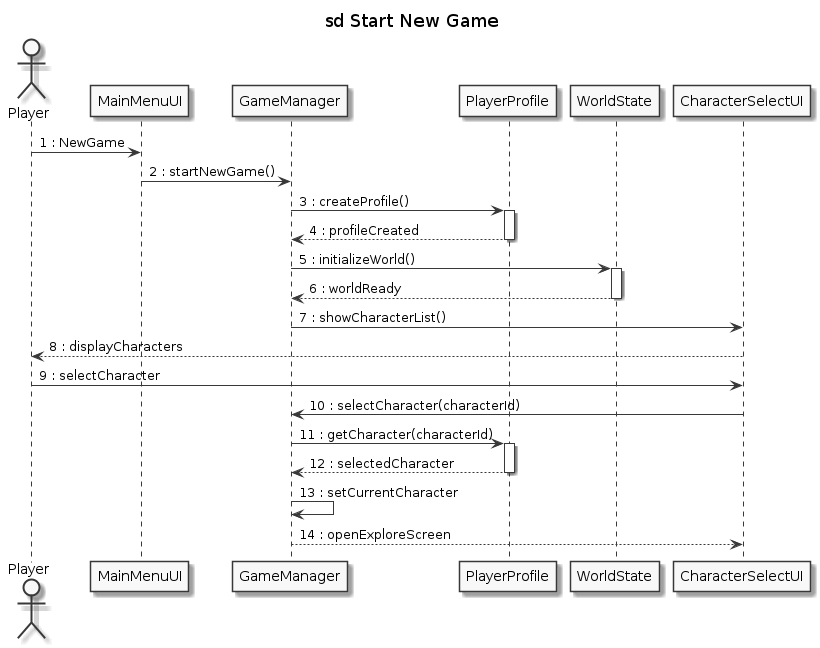
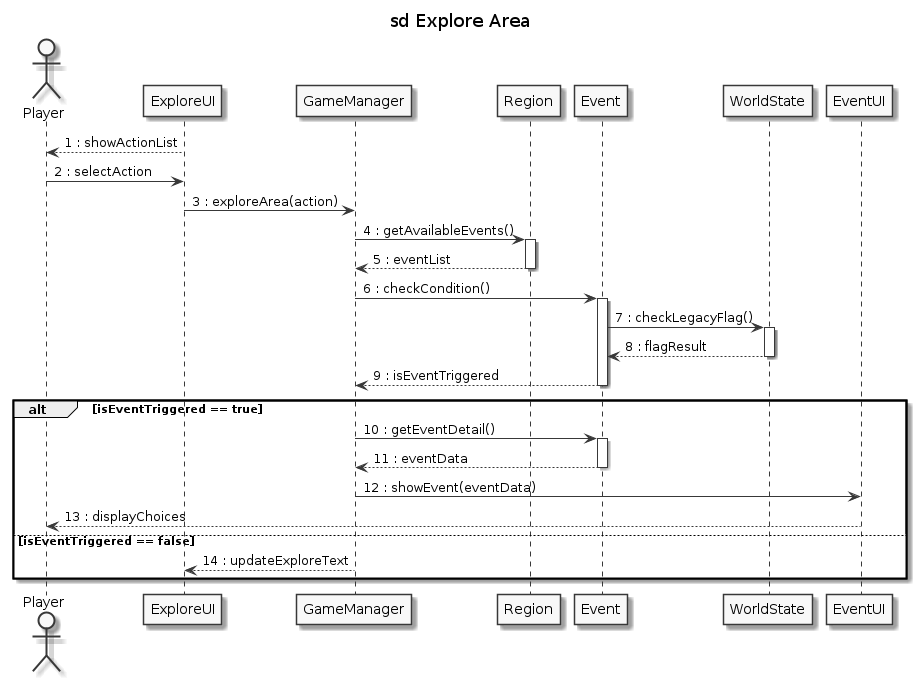
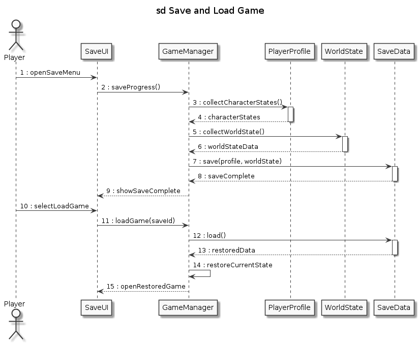
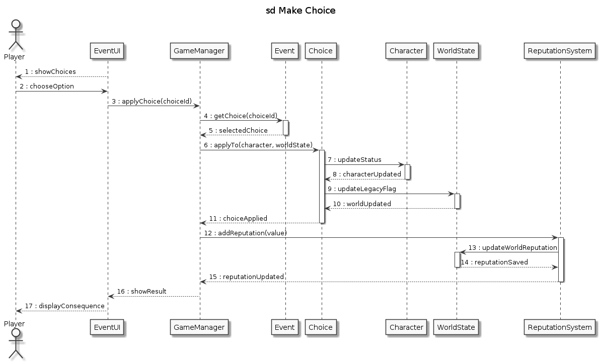
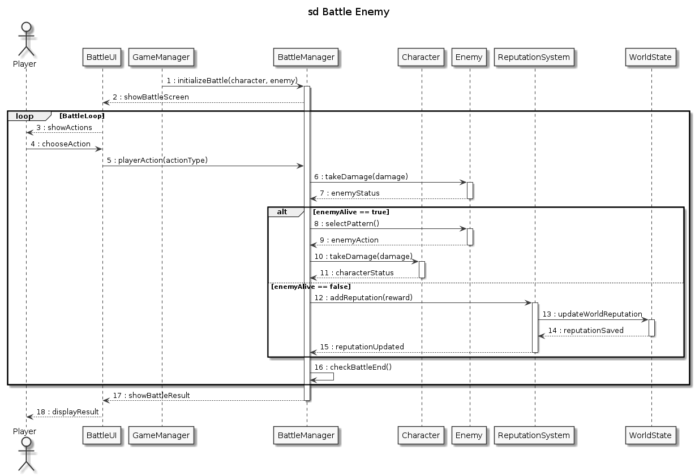
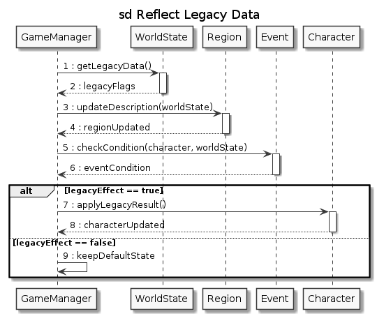

# Echoes of Legacy - Design Document

## Software Design Document

**학번:** 22210087  
**이름:** 김현서  
**이메일:** cinema312@naver.com

---

## Revision history

| Version # | Date | Description | Author |
|---|---|---|---|
| 0.3 | 2026-06-03 | 기획 및 Design 초안 작성 | 김현서 |

---

## Contents

- [1. Introduction](#1-introduction)
- [2. Class Diagram](#2-class-diagram)
  - [2.1 설계 원칙 및 아키텍처 구조](#21-설계-원칙-및-아키텍처-구조)
  - [2.2 UI Layer](#22-ui-layer)
  - [2.3 Control/Manager Layer](#23-controlmanager-layer)
  - [2.4 Domain Model Layer](#24-domain-model-layer)
  - [2.5 Persistence Layer](#25-persistence-layer)
- [3. Sequence Diagram](#3-sequence-diagram)
  - [3.1 Start New Game](#31-start-new-game)
  - [3.2 Explore Area](#32-explore-area)
  - [3.3 Save and Load Game](#33-save-and-load-game)
  - [3.4 Make Choice](#34-make-choice)
  - [3.5 Battle Enemy](#35-battle-enemy)
  - [3.6 Reflect Legacy Data](#36-reflect-legacy-data)
- [4. State Machine Diagram](#4-state-machine-diagram)
  - [4.1 시스템 전체 상태 전이](#41-시스템-전체-상태-전이)
  - [4.2 레거시 시스템이 상태 전이에 미치는 영향](#42-레거시-시스템이-상태-전이에-미치는-영향)
- [5. Implementation Requirements](#5-implementation-requirements)
  - [5.1 Hardware Requirements](#51-hardware-requirements)
  - [5.2 Software Requirements](#52-software-requirements)
  - [5.3 Nonfunctional Requirements](#53-nonfunctional-requirements)
- [6. Glossary](#6-glossary)
- [7. References](#7-references)

---

# 1. Introduction

본 문서는 판타지 세계관을 배경으로 하는 턴제 로그라이크 게임 **'Echoes of Legacy'**의 소프트웨어 설계 명세서다. Analysis 단계에서 정리한 요구사항과 개념 모델을 바탕으로, 구현 단계에서 바로 참고할 수 있는 정적 구조와 동적 흐름을 구체적으로 정리하는 데 목적이 있다.

'Echoes of Legacy'의 핵심은 일반적인 단일 주인공 중심 로그라이크와 구별되는 **다중 캐릭터 순차 플레이(Multi-character legacy system)**에 있다. 플레이어가 앞선 캐릭터로 남긴 성장 결과, 생존 여부, 명성치, 선택 기록은 세계(World) 데이터에 누적되며, 이후 캐릭터의 탐험 과정, 이벤트 발생 조건, NPC 대사, 파티 구성에까지 이어진다.

또한 본 게임은 화려한 3D 그래픽이나 복잡한 액션보다 텍스트와 정적 이미지 중심의 인터페이스에 무게를 둔다. 이러한 방향은 서사 전달에 집중하기에 적절하며, 학기 프로젝트 범위 안에서 구현 가능성과 모듈성을 함께 확보하는 데에도 도움이 된다.

---

# 2. Class Diagram

## 2.1 설계 원칙 및 아키텍처 구조

본 시스템은 Unity 엔진 환경을 고려하되, 객체지향 설계 원칙에 따라 역할과 책임을 분명하게 나누는 방향으로 설계한다. 주요 설계 원칙은 다음과 같다.

- **UI와 비즈니스 로직의 분리:** 화면 출력과 사용자 입력 처리(UI Layer)는 내부 데이터 처리와 게임 흐름 제어(Control/Manager Layer)와 분리하여, UI 변경이 핵심 로직에 직접적인 영향을 주지 않도록 한다.
- **레거시 데이터와 현재 진행 데이터의 분리:** 현재 플레이 중인 캐릭터의 데이터(`Character`, `Inventory`)와 다음 플레이에 영향을 남기는 전역 데이터(`WorldState`, `ReputationSystem`)를 구분하여 관리한다.
- **계층화된 아키텍처:** 시스템을 UI Layer, Control/Manager Layer, Domain Model Layer, Persistence Layer의 네 계층으로 나누어 유지보수성과 확장성을 높인다.

## 2.2 UI Layer

UI Layer는 플레이어에게 게임 정보를 보여주고 입력을 받아 Controller 계층으로 전달하는 역할을 맡는다.

| 항목 | 내용 |
|---|---|
| Class Name | MainMenuUI |
| Explanation | 게임 시작 시 가장 먼저 보이는 메인 타이틀 화면을 담당하는 UI 컨트롤러다. |
| Attributes | `startButton: Button` `loadButton: Button` |
| Methods | `OnClickNewGame(): void` `OnClickLoadGame(): void` |
| Relationships | `GameManager`에 `startNewGame()` 또는 `loadGame()`을 요청한다. |

| 항목 | 내용 |
|---|---|
| Class Name | CharacterSelectUI / ExploreUI / EventUI / BattleUI / SaveUI |
| Explanation | 캐릭터 선택, 탐험, 이벤트, 전투, 저장/불러오기 등 각 상태에 맞는 화면을 표시하고 사용자 입력을 처리하는 UI 클래스 그룹이다. |
| Attributes | `displayTexts: Text[]` `actionButtons: Button[]` `currentContextData: Object` |
| Methods | `UpdateDisplay(data: Object): void` `OnActionSelected(actionId: int): void` |
| Relationships | `GameManager`와 `BattleManager`로부터 데이터를 받아 화면을 갱신하고, 사용자 입력을 다시 Manager 계층에 전달한다. |

## 2.3 Control/Manager Layer

Control/Manager Layer는 게임의 상태 전환과 주요 비즈니스 흐름을 관리하는 중심 계층이다.

| 항목 | 내용 |
|---|---|
| Class Name | GameManager |
| Explanation | 게임 전체의 라이프사이클, 상태 전환, 각 모듈 간 통신을 중앙에서 관리하는 싱글톤(Singleton) 클래스다. |
| Attributes | `currentState: GameState` `activeProfile: PlayerProfile` `worldState: WorldState` |
| Methods | `startNewGame(): void` `loadGame(saveId: int): void` `selectCharacter(characterId: int): void` `exploreArea(action: string): void` `applyChoice(choiceId: int): void` `saveProgress(): void` |
| Relationships | 모든 UI 클래스로부터 입력을 전달받고, `WorldState`, `Character` 등의 Domain Model 객체를 호출하여 게임 로직을 처리한다. |

| 항목 | 내용 |
|---|---|
| Class Name | BattleManager |
| Explanation | 턴제 전투의 시작, 진행, 종료와 데미지 계산을 전담하는 컨트롤러다. |
| Attributes | `activeCharacter: Character` `currentEnemy: Enemy` `turnCount: int` |
| Methods | `initializeBattle(c: Character, e: Enemy): void` `playerAction(actionType: string): void` `processEnemyTurn(): void` `checkBattleEnd(): boolean` |
| Relationships | `GameManager`의 호출로 동작하며, 전투 종료 후 보상 데이터를 `ReputationSystem`에 전달한다. |

## 2.4 Domain Model Layer

Domain Model Layer는 게임의 핵심 데이터와 규칙을 담고 있는 모델 객체들로 구성된다.

| 항목 | 내용 |
|---|---|
| Class Name | PlayerProfile / Character / Inventory / Item |
| Explanation | 플레이어 세션 정보와 개별 캐릭터의 상태를 관리하는 데이터 모델 그룹이다. |
| Attributes | (`Character` 기준) `characterId: int` `hp: int, attack: int, defense: int` `alive: boolean` `inventory: Inventory` |
| Methods | `updateStatus(deltaHp: int): void` `applyLegacyResult(legacyData: Object): void` `takeDamage(damage: int): int` |
| Relationships | `PlayerProfile`은 여러 `Character`를 포함하며, 각 `Character`는 `Inventory`와 그 안의 `Item`을 참조한다. |

| 항목 | 내용 |
|---|---|
| Class Name | WorldState / ReputationSystem |
| Explanation | 이전 캐릭터들의 선택과 업적이 누적된 세계 상태(Legacy System)와 명성치 정보를 관리하는 모델 그룹이다. |
| Attributes | `legacyFlags: Dictionary<string, bool>` `liberatedRegions: List<int>` `totalReputation: int` |
| Methods | `checkLegacyFlag(flagKey: string): boolean` `updateLegacyFlag(flagKey: string, value: bool): void` `addReputation(value: int): void` |
| Relationships | `Event`와 `GameManager`가 이 객체들을 참조하여, 특정 이벤트나 대사가 이전 플레이의 영향을 반영하도록 한다. |

| 항목 | 내용 |
|---|---|
| Class Name | Region / Event / Choice / Party / Enemy |
| Explanation | 탐험, 이벤트, 적 등 게임 안의 주요 환경 요소를 정의하는 클래스 그룹이다. |
| Attributes | (`Event` 기준) `eventId: int` `triggerCondition: string` `choices: List<Choice>` |
| Methods | `checkCondition(c: Character, w: WorldState): boolean` `getChoice(choiceId: int): Choice` |
| Relationships | `Region`에는 여러 `Event`가 포함되며, 각 `Event`는 여러 `Choice`를 가진다. 또한 일정 조건을 만족한 `Character`들은 `Party`를 구성할 수 있다. |

## 2.5 Persistence Layer

| 항목 | 내용 |
|---|---|
| Class Name | SaveData |
| Explanation | 로컬 저장소에 게임 데이터를 직렬화하여 저장하고, 다시 불러오는 영속성 관리 클래스다. |
| Attributes | `saveId: int` `timestamp: DateTime` `serializedWorldState: string` `serializedCharacters: string` |
| Methods | `save(profile: PlayerProfile, world: WorldState): boolean` `load(saveId: int): SaveData` |
| Relationships | `GameManager`의 요청을 받아 도메인 객체의 상태를 저장 파일 형식으로 변환하고 다시 복원한다. |

---

# 3. Sequence Diagram

본 장에서는 객체 사이의 동적 상호작용을 시간 흐름에 따라 정리한 시퀀스 다이어그램을 다룬다. 각 시나리오는 핵심 유스케이스를 기준으로 구성하였다.

## 3.1 Start New Game

- **시나리오 설명:** 사용자가 메인 메뉴에서 새 게임을 선택했을 때, 시스템이 기본 프로필과 월드 데이터를 초기화한 뒤 캐릭터 선택 화면을 거쳐 탐험 화면으로 이동하는 과정이다.
- **참여 객체:** Player(액터), MainMenuUI, GameManager, PlayerProfile, WorldState, CharacterSelectUI
- **주요 메시지 흐름:**
  1. Player가 `MainMenuUI`에서 NewGame을 선택하면 `GameManager.startNewGame()`이 호출된다.
  2. `GameManager`는 `PlayerProfile.createProfile()`과 `WorldState.initializeWorld()`를 차례로 호출해 초기 환경을 준비한다.
  3. 초기화가 끝나면 `GameManager`는 `CharacterSelectUI`를 통해 캐릭터 목록을 보여준다.
  4. Player가 특정 캐릭터를 선택(selectCharacter)하면 해당 캐릭터 정보가 설정되고, `openExploreScreen()`을 통해 탐험 화면으로 진입한다.

## 3.2 Explore Area

- **시나리오 설명:** 플레이어가 특정 지역을 탐험할 때, 월드의 Legacy 데이터(과거 기록)를 확인하여 특수 이벤트 발생 여부를 판단하고 그 결과를 화면에 반영하는 과정이다.
- **참여 객체:** Player, ExploreUI, GameManager, Region, Event, WorldState, EventUI
- **주요 메시지 흐름 및 조건(Alt):**
  1. Player가 탐험 액션을 선택하면 `GameManager`가 `Region`으로부터 현재 지역에서 가능한 `Event` 목록을 가져온다.
  2. `GameManager`는 `Event.checkCondition()`을 호출하고, 이 과정에서 `WorldState.checkLegacyFlag()`를 통해 레거시 조건을 확인한다.
  3. **[alt: isEventTriggered == true]** 조건이 만족되면 이벤트 상세 데이터를 불러와 `EventUI`에 선택지와 상황을 표시(showEvent)한다.
  4. **[alt: isEventTriggered == false]** 조건이 충족되지 않으면 일반 탐험 텍스트만 `ExploreUI`에 갱신(updateExploreText)한다.

## 3.3 Save and Load Game

**그림 3-3: Save and Load Game**

- **시나리오 설명:** 플레이어가 현재 진행 상황을 파일에 저장하거나, 기존 저장 파일을 불러와 이전 상태로 복원하는 과정이다. 레거시 데이터까지 함께 다뤄야 하므로 여러 모델 객체에서 데이터를 수집하는 절차가 중요하다.
- **참여 객체:** Player, SaveUI, GameManager, PlayerProfile, WorldState, SaveData
- **주요 메시지 흐름:**
  1. 저장(Save) 시 `GameManager`는 `PlayerProfile`에서 캐릭터 상태를, `WorldState`에서 레거시 및 월드 상태를 각각 수집한다.
  2. 수집한 데이터를 바탕으로 `SaveData.save()`를 호출해 영구 저장소에 기록하고, 그 결과를 UI에 전달한다.
  3. 불러오기(Load) 시 `GameManager`는 `SaveData.load(saveId)`를 호출하여 직렬화된 데이터를 받아 현재 상태로 복원(restoreCurrentState)한 뒤 게임 화면을 연다.

## 3.4 Make Choice

- **시나리오 설명:** 이벤트 화면에서 플레이어가 특정 선택지를 고르면, 그 결과가 즉각적인 능력치 변화에 그치지 않고 레거시 데이터와 평판 시스템에도 함께 반영되는 과정이다.
- **참여 객체:** Player, EventUI, GameManager, Event, Choice, Character, WorldState, ReputationSystem
- **주요 메시지 흐름:**
  1. Player가 `EventUI`에서 옵션을 선택하면 `GameManager.applyChoice()`가 호출된다.
  2. `Choice.applyTo()`가 실행되면서 현재 `Character`의 상태 업데이트와 `WorldState`의 Legacy Flag 갱신이 함께 이루어진다.
  3. 이후 `ReputationSystem.addReputation()`을 통해 누적 명성치가 갱신되고, 결과는 종합되어 `EventUI.showResult()`로 출력된다.

## 3.5 Battle Enemy

**그림 3-5: Battle Enemy**

- **시나리오 설명:** 턴제 전투의 시작, 반복되는 턴 처리, 적 사망 이후의 보상 및 평판 갱신까지 이어지는 전체 과정을 보여준다.
- **참여 객체:** Player, BattleUI, GameManager, BattleManager, Character, Enemy, ReputationSystem, WorldState
- **주요 메시지 흐름 및 조건(Loop/Alt):**
  1. `GameManager`가 `BattleManager.initializeBattle()`을 호출하여 전투를 시작한다.
  2. **[loop: BattleLoop]** Player가 액션을 선택하면 `Enemy`에게 데미지를 주고 상태(enemyAlive)를 확인한다.
  3. **[alt: enemyAlive == true]** 적이 살아 있으면 적의 AI 패턴을 선택해 Player의 `Character`에 데미지를 주고 다음 턴으로 넘어간다.
  4. **[alt: enemyAlive == false]** 적이 사망하면 `ReputationSystem`에 보상을 반영하고 루프를 종료한다.
  5. 마지막으로 전투 결과를 `BattleUI`를 통해 플레이어에게 보여준다.

## 3.6 Reflect Legacy Data

**그림 3-6: Reflect Legacy Data**

- **시나리오 설명:** 새로운 캐릭터로 플레이를 시작하거나 특정 지역에 들어설 때, 이전 캐릭터의 플레이 기록(Legacy)을 읽어 현재 게임 환경과 캐릭터 상태에 반영하는 과정이다.
- **참여 객체:** GameManager, WorldState, Region, Event, Character
- **주요 메시지 흐름 및 조건(Alt):**
  1. `GameManager`가 `WorldState.getLegacyData()`를 호출하여 누적된 legacyFlags를 가져온다.
  2. 이를 바탕으로 `Region.updateDescription(worldState)`를 호출해 지역의 텍스트 설명을 바꾼다.
  3. `Event.checkCondition()`을 통해 특수 조건(legacyEffect) 충족 여부를 판단한다.
  4. **[alt: legacyEffect == true]** 조건이 충족되면 `Character.applyLegacyResult()`를 호출해 보너스 능력치 또는 페널티를 반영한다.
  5. **[alt: legacyEffect == false]** 조건이 맞지 않으면 기본 상태(keepDefaultState)를 유지한다.

---

# 4. State Machine Diagram

본 장에서는 시스템 전체를 하나의 추상화된 객체(Game Application)로 보고, 화면 전환과 내부 로직 처리에 따라 어떤 상태 변화가 일어나는지 정리한다.

## 4.1 시스템 전체 상태 전이

| Source State | Trigger (이벤트/조건) | Target State | Action (수행 내용) |
|---|---|---|---|
| [Initial] | 게임 실행 | Main Title | MainMenuUI 렌더링, 리소스 로드 |
| Main Title | New Game 클릭 | Character Select | WorldState 초기화, 시작 프로필 생성 |
| Main Title | Load Game 클릭 | Save/Load | 저장된 슬롯 목록 출력 |
| Save/Load | 저장 파일 선택 | Exploration | SaveData 로드, 이전 위치로 화면 전환 |
| Character Select | 캐릭터 확정 | Legacy Reflection | 선택된 캐릭터에 과거 World 기록 연산 및 동기화 |
| Legacy Reflection | 레거시 연산 완료 | Exploration | 탐험 UI 출력 (텍스트/이미지 갱신) |
| Exploration | 이벤트/오브젝트 상호작용 | Event/Choice | 선택지 UI 출력, 스토리 텍스트 전개 |
| Exploration | 적 조우 | Battle | 전투 화면 전환, BattleManager 초기화 |
| Event/Choice | 특정 NPC/이전 캐릭터 조우 | Party Formation | 생존 조건 체크, 파티 명단에 합류 처리 |
| Event/Choice | 선택 완료 / 보상 획득 | Exploration | WorldState 갱신 후 탐험 복귀 |
| Battle | 적 HP 0 도달 (승리) | Exploration | 명성치 획득, 보상 수령 후 복귀 |
| Battle | 캐릭터 HP 0 도달 (패배) | Game Over/Ending | 캐릭터 사망 기록(Legacy) 저장, 다음 캐릭터 유도 |
| Exploration | 메뉴 - 저장 선택 | Save Complete | 현재 상태 직렬화 후 디스크 쓰기 완료 |
| Save Complete | 확인 버튼 클릭 | Exploration | 이전 탐험 상태로 회귀 |

## 4.2 레거시 시스템이 상태 전이에 미치는 영향

'Echoes of Legacy'의 가장 큰 특징은 단순히 Exploration과 Battle 상태를 오가는 구조에 머무르지 않고, 그 사이에 **Legacy Reflection**과 **Party Formation** 상태가 개입한다는 점이다.

캐릭터가 사망하거나(Game Over) 특정 스토리를 마치고 다음 캐릭터로 넘어갈 때, 시스템은 단순히 진행을 종료하지 않고 세계 상태(WorldState)를 먼저 갱신한다. 이후 새 캐릭터를 선택(Character Select)하고 탐험에 들어가기 직전, 시스템은 **Legacy Reflection State**로 이동해 이전 회차의 명성치와 선택 결과(Legacy Flags)를 해석한다. 이러한 상태 전이를 통해 같은 맵(Region)이라도 등장하는 이벤트(Event)나 적의 종류가 달라질 수 있으며, 플레이 경험 역시 회차마다 달라진다.

---

# 5. Implementation Requirements

본 프로젝트는 텍스트와 정적 이미지 중심의 PC 기반 게임을 목표로 하며, 구현과 실행을 위해 다음과 같은 하드웨어 및 소프트웨어 환경을 기준으로 한다.

## 5.1 Hardware Requirements

**[Minimum Specification]**

- **CPU:** Intel Core i3 4세대 이상 또는 AMD 동급 프로세서
- **RAM:** 4GB 이상
- **Storage:** 2GB 이상의 여유 공간 (HDD 또는 SSD)
- **Display:** 1280 x 720 이상의 해상도를 지원하는 모니터

**[Recommended Specification]**

- **CPU:** Intel Core i5 8세대 이상 또는 AMD Ryzen 3 이상
- **RAM:** 8GB 이상
- **Storage:** SSD 내 5GB 이상의 여유 공간
- **Display:** 1920 x 1080 (FHD) 권장

## 5.2 Software Requirements

- **Operating System:** Windows 10 (64-bit) 이상 / macOS 11.0 이상
- **Game Engine:** Unity Engine 2022.3 LTS 이상
- **Implementation Language:** C# (.NET Framework 4.7 이상 호환)
- **IDE (개발 환경):** Visual Studio 2022 또는 Unity
- **Version Control:** Git, GitHub Desktop

## 5.3 Nonfunctional Requirements

- **UI 및 시각적 성능 (Usability):** 본 게임은 화려한 3D 그래픽 대신 텍스트와 정적 이미지 중심의 인터페이스를 사용한다. 따라서 권장 사양보다 낮은 환경에서도 큰 프레임 저하 없이 안정적으로 동작해야 하며, 무엇보다 텍스트 가독성을 우선으로 고려해야 한다.
- **저장 신뢰성 (Reliability):** 레거시 시스템은 이전 플레이 기록의 무결성에 크게 의존한다. 따라서 SaveData 저장 중 강제 종료가 발생하더라도 데이터가 손상되지 않도록, 임시 파일(Temp)을 먼저 작성한 뒤 최종 파일에 반영하는 안전한 직렬화 방식을 사용해야 한다.
- **모듈성 및 확장성 (Modularity & Scalability):** 캐릭터, 이벤트, 지역 정보는 하드코딩보다 JSON 형식의 외부 데이터나 Unity ScriptableObject로 구조화하는 편이 적절하다. 이렇게 하면 이후 새로운 캐릭터나 스토리를 코드 수정 없이도 비교적 쉽게 추가할 수 있다.
- **응답 시간 (Performance):** 씬(Scene) 전환과 텍스트 렌더링은 플레이어 입력 후 0.5초 이내에 이루어져야 하며, 이를 통해 텍스트 어드벤처 특유의 빠르고 직관적인 진행감을 유지해야 한다.

---

# 6. Glossary

| Term | Definition |
|---|---|
| **Legacy System (레거시 시스템)** | 이전 캐릭터의 선택, 전투 결과, 생존 여부 등의 기록이 다음 캐릭터의 플레이 환경(NPC 대사, 지역 개방 등)에 계속 영향을 미치도록 하는 본 게임의 핵심 시스템. |
| **Reputation System (명성치 시스템)** | 플레이어의 특정 행동이나 전투 승리에 따라 누적되는 점수이며, 수치에 따라 특수 이벤트 발동이나 파티 구성 조건으로 작용한다. |
| **Roguelike (로그라이크)** | 절차적 생성, 영구적 죽음 등의 특징을 가지는 롤플레잉 게임의 하위 장르다. 본 게임은 이를 차용하되, 단일 주인공이 아닌 다중 캐릭터 구조를 통해 죽음을 세계관 안의 서사로 연결한다. |
| **WorldState** | 개별 캐릭터의 스탯이 아니라, 게임 세계 전체의 누적 변화(해방된 지역, 남겨진 아이템, 레거시 플래그 등)를 저장하고 관리하는 전역 도메인 객체다. |
| **Unity Engine** | 크로스 플랫폼 게임 엔진이다. 본 프로젝트에서는 2D UI와 스크립팅 기능을 활용해 텍스트 기반 인터페이스를 구현하는 데 사용한다. |
| **Turn-based (턴제)** | 전투에서 플레이어와 적이 순서대로 한 번씩 행동(공격, 방어, 스킬 사용 등)을 주고받는 방식이다. |
| **Event** | 탐험 중 특정 지역에 도달하거나 오브젝트와 상호작용할 때 발생하는 서사적 사건 단위다. |
| **Choice** | 이벤트 진행 중 플레이어에게 주어지는 선택지다. 각 선택은 캐릭터 상태 변화와 월드의 레거시 플래그 변경(Consequence)을 함께 일으킨다. |
| **Persistence Layer** | 메모리에 존재하는 게임 데이터를 로컬 디스크 파일(SaveData) 구조로 직렬화하여 지속적으로 보존하는 데이터 관리 계층이다. |
| **Domain Model** | 시스템이 다루는 핵심 비즈니스 로직과 데이터(캐릭터, 지역, 적 등)를 객체 중심으로 구조화한 설계 모델이다. |

---

# 7. References

1. 김현서, *Echoes of Legacy - Analysis Document (Version 0.2)*, 2026. (본 프로젝트 선행 과제)
2. 김현서, *Echoes of Legacy - Conceptualization (Version 0.1)*, 2026. (본 프로젝트 선행 과제)